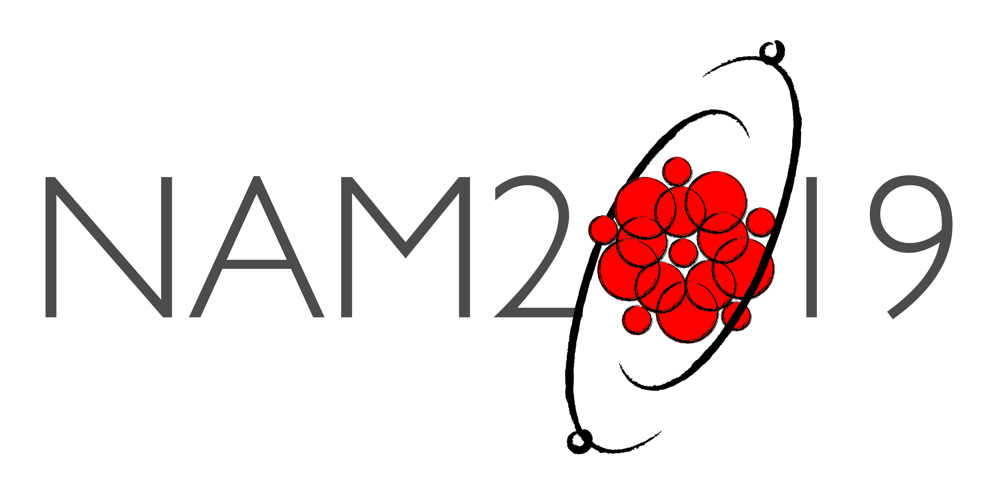

The New Robotic Telescope (NRT) group will be organising a session at this year's National Astronomy Meeting (NAM) from 30th June - 4th July. Hosted by the Royal Astronomical Society, NAM2019 will be held at Lancaster University. As part of the 4 day conference, two 90 minute sessions will be held to discuss the future science topics for the NRT, along with the instrumentation requirements for the most effective time domain research.

The [abstract deadline](https://nam2019.org/science/abstract-submission) is 15th March, we invite all our current and future users to submit a poster or talk abstract to discuss the exciting new science that can be carried out with a 4-metre robotic telescope, and we strongly encourage all to attend to join in the discussion.

[Click here for more details of the conference](https://nam2019.org/) and for more details of the session contact Helen Jermak <h.e.jermak@ljmu.ac.uk>.

