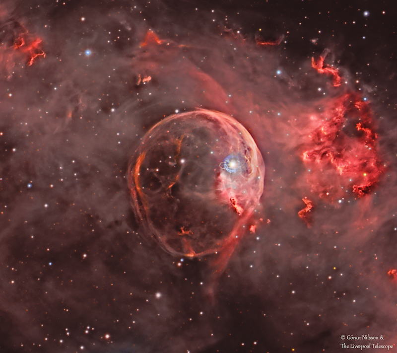

## The National Schools' Observatory

The Liverpool Telescope exceeds at public outreach and schools engagement through the [National Schools' Observatory (NSO)](https://www.schoolsobservatory.org/), who are also part of the Astrophysics Research Institute at Liverpool John Moores University. Established in 2004, the NSO has a mission to enable **access to the Universe for all** and have created a website to allow children and other interested members of the public to access data from the LT by submitting request through an online 'Go Observing' graphical user interface. 

Many of the images requested by school children have been enhanced by astrophotographers Wim van Berlo and Goran Nilsson and can be viewed on the [LT flickr account](https://www.flickr.com/photos/149839008@N02/albums/72157686412640266/with/35722140881/). One of these stunning images of the Bubble Nebulae appeared on [NASA's 'Astronomy Picture of the Day (APOD)'](https://apod.nasa.gov/apod/ap180205.html) on 5th February 2018.

{: .align-center}

The NSO also runs a variety of outreach seminars, workshops and events across the UK; with the LT being represented at a variety of exciting functions including the RHS Chelsea Flower Show, The Big Brownie Birthday Bash, Cosford Air Show and the Bluedot music festival at Jodrell Bank. 

## NRT outreach and engagement

Outreach and engagment has been a core focus of the Liverpool Telescope since the beginning and this will continue with the New Robotic Telescope project. With more time being made available for the use of children worldwide through the NSO, we hope to make the global impact of the NRT and LT a key driver over the lifetime of the project. The wide-field capabilities of the future simplified LT will allow stunning images of the universe to be taken by children the world over, with the aim to encourage and inspire more to pursue science, technology, engineering and mathematics (STEM) subjects.
