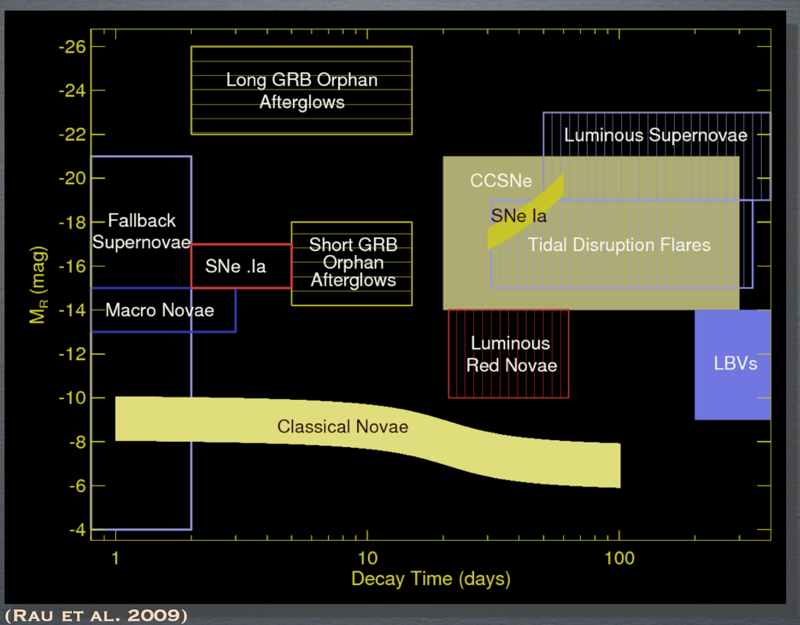

The New Robotic Telescope will be one of the fastest responding ground-based optical facilities, designed for rapid response to triggers and using its speed and autonomous responses to be first on target for many fast and fading sources. The key science drivers for the NRT are time-domain sources: highly variable and transient objects whose cadence, brightness, predictability and origin are often unknown prior to discovery. The source of their variable and transient nature is either intrinsic (such as the cataclysmic death of a star in a supernova explosion) or extrinsic (the transit of an exoplanet past its host star). The image below shows an example of known intrinsically variable sources.

These sources are notoriously difficult to follow-up. The design of the NRT with its rapid slew rate, automated response to triggers and 4-metre primary mirror is ideal for the study of sources such as supernovae, gamma-ray bursts, electromagnetic counterparts to gravitational wave sources, exoplanets, Gaia sources, fast-radio bursts, and new and currently unknown sources that will be discovered in the coming years. 

The main science requirements of the NRT are:
* Robotic, triggerable, rapid data dissemination
* Wide spectral range
* Low/intermediate resolution (R~100-5000), robotic aquisition spectroscopic capabilities
* Spectroscopic Magnitude limit r'~21-22
* Multiband, time-resolved photometry and polarimetry
* Rapid slew to target, with low overheads
{: .notice--info}

In particular the NRT will carry out 
* ultra-rapid (<30 seconds) spectroscopic and polarimetric follow-up of electromagnetic counterparts of gravitational wave ([aLIGO](https://www.advancedligo.mit.edu/)/[Virgo](http://www.virgo-gw.eu/)) and neutrino ([IceCUBE](https://icecube.wisc.edu/)/[ANTARES](http://antares.in2p3.fr/)) sources and new radio (e.g. [LOFAR](http://www.lofar.org/)/[SUPERB](https://sites.google.com/site/publicsuperb/)) and high energy (e.g. [SVOM](http://www.svom.fr/en/), [Fermi](https://fermi.gsfc.nasa.gov/), [Einstein Probe](http://ep.bao.ac.cn/)) transients, 
* rapid (<1hr) spectroscopy and polarimetry of (e.g. [LSST](https://www.lsst.org/)/[ZTF](https://www.ztf.caltech.edu/)) supernovae (SNe) to explore the shock-breakout phase and find spectral signatures of the progenitor, and of recurrent novae (the supposed progenitors of Type Ia SNe), 
* timely (<24 hours) and time resolved spectroscopy of the evolution of the afor mentioned sources, plus galactic transients such as outbursting binary X-ray transients and eruptive Young Stellar Objects (YSOs) detected by [VISTA](http://www.vista.ac.uk/)/[Pan-STARRS](https://panstarrs.stsci.edu/)/[LSST](https://www.lsst.org/), and
* simultaneous spectroscopic and polarimetric monitoring of pre-scheduled observations of sources such as blazars (e.g. with [Fermi](https://fermi.gsfc.nasa.gov/), [CTA](https://www.cta-observatory.org/)) and changing-look AGN.
{: .notice--info}

# Explosive transient trigger response

The Liverpool Telescope's autonomous and robotic follow-up has been key for Gamma-ray burst science. The rapidly fading nature of short Gamma-ray bursts means that traditional telescopes struggle to catch the source before it has become too faint. The automated response to [NASA Swift](https://swift.gsfc.nasa.gov/) triggers, without human intervention, allows the LT to take data within minutes of outburst. For the NRT we aim to be on target, taking observations, within 30 seconds of a trigger. This will allow a new generation of transient objects, discovered with facilities such as [SVOM](http://www.svom.fr/en/), to be routinely optically observed during the prompt emission phase for the first time.

Robotic Telescopes like the NRT are uniquely suited to the task of transient follow-up since they can flexibly and automatically react to new discoveries in real time. They are quick to react to the most exciting targets: in the era of fast discovery, the follow-up must proceed with a similar alacrity. The LT is currently a world-leading facility for time-domain rapid response, but the sensitivity of the new discovery facilities means the fainter targets will require a larger aperture optical follow-up facility.

#  Survey follow-up

The profile of time domain astrophysics will rise immensely in the coming decades, since temporal work will be a key component of many new ground- and space-based facilities. From the ground, huge numbers of optical transients are being discovered by new 'synoptic surveys', such as [iPTF](https://www.ptf.caltech.edu/iptf)/[ZTF](https://www.ztf.caltech.edu/) and [Pan-STARRS](https://panstarrs.stsci.edu/). A key new survey astronomy facility will be the Large Synoptic Sky Survey [LSST](https://www.lsst.org/). The LSST, under construction on Cerro Pachón, Chile, will offer cadence and depth, leading a new 'faint and fast' discovery regime. The LSST will join other transient discovery facilities in the Southern Hemisphere such as [Public ESO Spectroscopic Survey for Transient Objects (PESSTO)](http://www.pessto.org/), [SoXS](https://www.eso.org/sci/facilities/develop/instruments/SoXS.html) and [SkyMapper](https://rsaa.anu.edu.au/observatories/telescopes/skymapper-telescope). Although the NRT will be in the Northern hemisphere there is still a considerable area of sky overlap. The high observing efficiency of NRT will afford the best opportunity to efficiently spectroscopically follow-up LSST sources, essential for delivering astrophysical insight.

In addition new Northern Hemisphere facilities such as the [ZTF](https://www.ztf.caltech.edu/) offer sensitivity and field-of-view improvements over their predecessors. There is a critical need for follow-up capacity to provide the spectroscopic classifications and multi-band light curves required for exploitation of the survey telescopes' discoveries. Dedicated follow-up telescopes are vital as the rate of targets-of-opportunity will be too high to rely on priority overrides on existing facilities (which would interrupt their existing science programmes). The [PESSTO](http://www.pessto.org/) programme demonstrated the value of dedicating large amounts of telescope time to transient follow-up. In the new era, the [New Technology Telescope (NTT)](https://www.eso.org/sci/facilities/lasilla/telescopes/ntt.html) and the [Son of X-Shooter (SoXS)](https://www.eso.org/sci/facilities/develop/instruments/SoXS.html) instrument will fill this role in the Southern hemisphere, and NRT will be the ideal Northern counterpart. 

## Multi-wavelength and multimessenger astronomy

The next decade will see the exploration of the time-domain sky in different electromagnetic regimes via facilities such as the Cherenkov Telescope Array ([CTA](https://www.cta-observatory.org/)); the northern component of which will be co-located with the NRT on La Palma), [eRoSITA](http://www.mpe.mpg.de/eROSITA) and [LOw-Frequency ARray (LOFAR]([http://www.lofar.org/)). We are also entering the multimessenger era, in which sources are discovered via their gravitational wave ([aLIGO](https://www.advancedligo.mit.edu/)/[Virgo](http://www.virgo-gw.eu/)) or neutrino ([IceCUBE](https://icecube.wisc.edu/)) emission and follow-up is conducted to search for their electromagnetic counterparts. The discovery potential via the use of multimessengers is immense, and the campaigns around the detection of gravitational wave emission from the [GW170817](https://arxiv.org/abs/1710.05832) neutron star merger and the neutrino detection from the blazar TXS 0506+056 highlight the importance of EM follow-up campaigns for verification and elucidation of the event. The NRT will continue to lead the rapid response of ground-based facilities by being on target and taking data within 30 seconds of trigger, catching faint, rapidly fading sources before larger facilities.

## Overcoming positional uncertainty

Facilities such as [CTA](https://www.cta-observatory.org/), [aLIGO](https://www.advancedligo.mit.edu/) and [IceCUBE](https://icecube.wisc.edu/) share a common problem for electromagnetic follow-up: large positional uncertainty. The problem is distinguishing the true counterpart from the large numbers of unrelated candidates in a sky region many square degrees in size. [GW170817](https://arxiv.org/abs/1710.05832) highlighted the importance of identifying the counterpart rapidly, since the first 12 hours showed a very rapid evolution in the transient spectrum, and these early observations were key to the physical understanding of the event. The rapid colour evolution of this source in the early hours was very distinct from what has previously been observed in supernovae, making these early time measurements vital for counterpart identification in this field. NRT will complement new discovery facilities such as the UK-led [GOTO](https://warwick.ac.uk/fac/sci/physics/research/astro/research/goto/) project, which will also be on La Palma. Automated cooperation between these two robotic facilities can provide colours and spectroscopic classifications within minutes of candidate discovery.

# Exoplanets 
The next generation of satellite surveys (e.g. [TESS](https://tess.gsfc.nasa.gov/), [PLATO](http://sci.esa.int/plato/)) will find a zoo of new exoplanets that require ground-based characterization. These surveys target bright host stars to maximise the potential for follow-up; providing a wider variety of time variable signatures to be explored for large numbers of exoplanets. The spectroscopic and polarimetric capabilities of the NRT can be exploited to explore the debris disks of these planetary systems. 

Along with observing large samples of exoplanets around bright stars, a secondary aim of the exoplanetary community has been to target small stars with the motivation of discovering Earth-sized worlds. It has been recognised that the transit depth for an Earth-sized exoplanet around an M-dwarf is the same as a hot Jupiter orbiting a G-dwarf. The strategy of targeting late type stars has paid off immensely with the discovery of an Earth-sized world around Proxima Centauri, along with the characterisation of seven such planets in the [TRAPPIST-1 system](http://www.trappist.one/) (a science programme in which the LT played and continues to play a prominent role). The difficulty is that host stars are extremely faint: TRAPPIST-1 has an Mv=18.4 despite being only 12 parsecs away. Due to the increasingly fainter targets, the need for a larger aperture follow-up telescope, such as the NRT, is even stronger.

# Solar System Science
Within our solar system, science is naturally dominated by the time domain. NRT will contribute to understanding the physics of individual Solar System objects (e.g. YORP effect in asteroids, simultaneous spectroscopy and polarimetry of small bodies in conjunction with rendezvous missions (e.g. [Psyche](https://www.jpl.nasa.gov/missions/psyche/), [Lucy](https://www.nasa.gov/content/goddard/lucy-the-first-mission-to-jupiter-s-trojans)) for gas and dust composition and dynamics, and monitoring the post [New Horizons](http://pluto.jhuapl.edu/) encounter evolution of the surface chemistry of Pluto). It will also support population studies where fast non-sidereal tracking will enable spectroscopic observations of moving targets, an important tool for taxonomy. The robotic operations model will allow rapid follow-up of new discoveries (e.g. [LSST](https://www.lsst.org/), [ZTF](https://www.ztf.caltech.edu/), [Pan-STARRS](https://panstarrs.stsci.edu/)) to extend the orbit arc and studies of transient events such as asteroid collisions and interstellar visitors.

Full details of the NRT science case can be found in the following publication :

[C. Copperwheat et. al, 2015](https://arxiv.org/abs/1410.1731)

In addition, if you would like more information about the NRT Science Case, or are a potential future user, please contact the NRT Project Scientist, Helen Jermak; <h.e.jermak@ljmu.ac.uk>.

