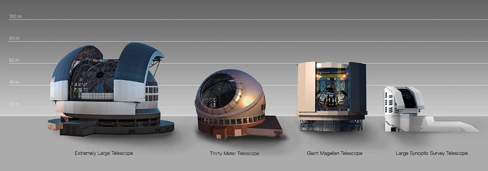

---
---
title:  "Science Case"

layout: post
toc: true
permalink: /science_case/
author_profile: false
comments: false
title: "MP4 Video"
modified:
categories: 
excerpt:
tags: []
image:
  feature:
date: 2014-11-18T11:34:04-05:00
---

This is testing out Liquid.

<video width="480" height="320" controls="controls">
  <source src="myfile.mp4" type="video/mp4">
</video>
The key science drivers are time-domain sources: highly variable and transient objects whose cadence, brightness, predictability and origin are often unknown prior to discovery. The source of their variable and tranisent nature is either intrinsic (such as the cataclysmic death of a star in a supernova explosion) or extrinsic (the transit of an exoplanet past its host star). These sources are notoriously difficult to follow-up. In particular the design of the NRT is ideal for the study of sources such as supernovae, gamma-ray bursts, electromagnetic counterparts to gravitational wave sources, exoplanets, Gaia sources, fast-radio bursts, and new and currently unknown sources that will be discovered in the coming years. 

This page summarises a variety of science drivers for the NRT. Full details can be found in the following publications:

[C. Copperwheat et. al, 2015](https://arxiv.org/abs/1410.1731)

[C. Copperwheat et. al, 2014](https://arxiv.org/abs/1408.1403)

In particular the NRT will carry out 
* ultra-rapid (<30 seconds) spectroscopic and polarimetric follow-up of electromagnetic counterparts of gravitational wave (aLIGO/Virgo) and neutrino (IceCUBE/ANTARES) sources and new radio (e.g. LOFAR/SUPERB) and high energy (e.g. SVOM, Fermi, Einstein Probe) transients, 
* rapid (<1hr) spectroscopy and polarimetry of (e.g. LSST/ZTF) supernovae (SNe) to explore the shock-breakout phase and find spectral signatures of the progenitor, and of recurrent novae (the supposed progenitors of Type Ia SNe), 
* timely (<24 hours) and time resolved spectroscopy of the evolution of the afor mentioned sources, plus galactic transients such as outbursting binary X-ray transients and eruptive Young Stellar Objects (YSOs) detected by VISTA/Pan-STARRS/LSST, and
* simultaneous spectroscopic and polarimetric montioring of pre scheduled observations of sources such as blazars (e.g. with Fermi, CTA) and changing-look AGN.
{: .notice--info}

# Explosive transient trigger response

{: .align-center}

The Liverpool Telescope's autonomous and robotic follow-up has been key for Gamma-ray burst science. The rapidly fading nature of short Gamma-ray bursts means that traditional telescopes struggle to catch the source before it has become too faint. The automated response to Swift triggers, without human intervention, allows the LT to take data within minutes of outburst. For the NRT we aim to be on target, taking observations, within 30 seconds of a trigger. This will allow a new generation of tranisent objects to be discovered.

Robotic Telescopes like the NRT are uniquely suited to the task of transient follow-up since they can flexibly and automatically react to new discoveries in real time. They are quick to react to the most exciting targets: in the era of fast discovery, the follow-up must proceed with a similar alacrity. The LT is currently a world-leading facility for time-domain rapid response, but the sensitivity of the new discovery facilities will require a larger aperture facility.

#  Survey follow-up

{: .align-center}

We are in the advent of time-domain astronomy with the flagship of the next generation of sky surveys, the Large Synoptic Sky Survey (LSST), under construction on Cerro Pachoón, Chile. The LSST will offer cadence and depth, meaning it will probe a new 'faint and fast' discovery regime. The LSST will join other transient discovery facilities in the southern hemisphere such as PESSTO, SoXS and SkyMapper. *evidence we have already followed-up southern hem targets*

New northern hemisphere facilities such as Zwicky Transient Facility (ZTF) also offer sensitivity and field-of-view improvements over their predecessors, and will target this new regime. There is a critical need for follow-up capacity to provide the spectroscopic classifications and multiband light curves required for exploitation of the discoveries of the survey telescopes. Moreover, dedicated follow-up telescopes are required as the rate of targets-of-opportunity will be too high to rely on priority overrides on existing facilities (which would interriupt their existing science programmes). The PESSTO (Public ESO Spectroscopic Survey for Transient Objects) programme demonstrated the value of dedicating large amounts of telescope time to transient follow-up. In the new era, NTT/SoXS will fill this role in the Southern hemisphere, and NRT will be the ideal Northern counterpart. 

The next decade will see the exploration of the time-domain sky in different electromagnetic regimes via facilities such as the Cherenkov Telescope Array (CTA; the northern component of which will be co-located with the NRT on La Palma). We are also starting to explore the sky in the multimessenger era, in which electromagnetic counterparts are pursued for sources discovered via their gravitational wave or neutrino emission. The discovery potential via the use of non-electromagnetic messengers for source detection is immense, and the campaigns around the detection of gravitational wave emission from the GW170807 neutron star merger and the neutrino detection from the blazar TXS 0506+056 highlight the importance of EM follow-up campaigns for verification and elucidation of the event. 

*+aLIGO eROSITA IceCube LOFAR*

Facilities such as CTA, aLIGO and IceCube share a common problem for electromagnetic follow-up: large positional uncertainty. The problem is distinguishing the true counterpart from the large numbers of unrelated candidates in a sky region many square degrees in size. GW170807 highlighted the importance of identifying the counterpart rapidly, since the first 12 hours showed a very rapid evolution in the transient spectrum, and these early observations were key to the physical understanding of the event. The rapid colour evolution of this source in the early hours was very distinct from what has previously been observed in supernovae, making these early time measurements vital for counterpart identification in this field. NRT will complement new discovery facilities such as the UK-led GOTO project which will also be on La Palma. Automated cooperation between these two robotic facilities would provide colours and spectroscopic classifications within minutes of candidate discovery.

Southern
PESSTO
SOXS
SkyMapper

LSST
ASKAP/MEERKAT/SKA

Northern
ZTF (iPTF, PTF)
PanSTARRS
SNLS

LOFAR

Both
CTA (high energy Gamma-rays)
Icecube
eROSITA
aLIGO/Virgo

# Exoplanets 
The next generation of satellite surveys (e.g. TESS, PLATO) will find a zoo of new exoplanets, which will require ground-based characterization. These surveys target bright host stars to maximise the potential for follow-up, this provides a wider variety of time variable signatures to be explored for large numbers of exoplanets. The spectroscopic and polarimetric capabilities of the NRT can be exploited to explore the debris disks of these planetary systems. 

Alongside the discovery of large samples of exoplanets around bright stars, a secondary aim of the exoplanetary community has been to specifically target small stars. The motivation here is the discovery of Earth-sized worlds, and it has been recognised that the transit depth for an Earth sized exoplanet around an M-dwarf is the same as a hot Jupiter orbiting a G-dwarf. The strategy of targeting late type stars has paid of immensely with the discovery of an Earth sized world around Proxima Centauri, and the characterisation of seven such planets in the TRAPPIST-1 system, a science programme in which the LT played and continues to play a prominent role. The problem here is that the host stars are extremely faint: TRAPPIST-1 has an Mv=18.4 despite being only 12 parsecs away. It is inevitable that future work in this direction will involve even fainter targets, driving the need for the larger aperture NRT for future follow-up programmes.

# Solar System Science
Within our solar system, science is naturally dominated by the time domain. NRT will contribute to understanding the physics of individual Solar System objects (e.g. YORP effect in asteroids, simultaneous spectroscopy and polarimetry of small bodies in conjunction with rendezvous missions (e.g. Psyche, Lucy) for gas and dust composition and dynamics, and monitoring the post New Horizons encounter evolution of the surface chemistry of Pluto). It will also support population studies where fast non-sidereal tracking will enable spectroscopic observations of moving targets, an important tool for taxonomy. The robotic operations model will allow rapid follow-up of new discoveries (e.g. LSST, ZTF, Pan-STARRS) to extend the orbit arc and studies of transient events such as asteroid collisions and interstellar visitors.

If you want more information about the NRT Science Case, or are a potential future user, please contact the NRT Project Scientist, Helen Jermak; <h.e.jermak@ljmu.ac.uk>.

