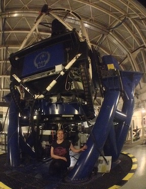
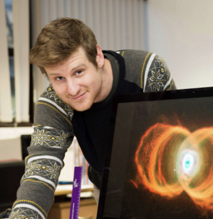



The NRT design team consist of staff from LJMU and IAC. Below is a brief bio and photo of each of the team members.

# LJMU

## Professor Iain Steele 
**NRT Director**

I am the LT Director and Head of the Technology Group at ARI, LJMU.  I obtained my PhD in observational infrared astronomy from the Univeristy of Leicester in 1994, and then worked as a Research Fellow at the University of Southampton until 1996 when I moved to LJMU to work on the original robotic telescope project.  My research interests include novel astronomical instrumentation, especially polarimetric and spectroscopic, as well as observational work on a wide range of time variable phenomena including GRBs, Be stars, blazars and exoplanets.  Although I am from Newcastle upon Tyne, I have absolutely no interest in football!

## Dr. Chris Copperwheat
**NRT Deputy-PI**

I am the Liverpool Telescope Astronomer in Charge and a Reader in Time Domain Astrophysics in the Astrophysics Research Institute at Liverpool John Moores University. I obtained my PhD in 2007 from University College London, and then worked as a postdoctoral researcher at the University of Warwick before joining LJMU in 2012. My research interests span a wide array of time variable phenomena, including (but not limited to) white dwarf binaries, exoplanets and gravitational wave counterparts.

## Mr. Adrian McGrath
**NRT Project Manager**

I am the New Robotic Telescope Project Manager. I am a Prince2 and Scrum Master qualified Project Manager who has used these methodologies in isolation and combined to deliver a variety of different sized projects.
Multi-disciplined projects like the NRT are a great opportunity to develop existing skills and learn new ones. I’m excited to discover what new skills I’m going acquire during this project.

## Dr. Helen Jermak
**NRT Project Scientist**

I obtained my PhD from LJMU in 2016 and worked as an E-ELT PDRA at Lancaster University, and an Instrument Scientist for the MOPTOP polarimeter project at LJMU before joining the NRT project in Spring 2018. My research interests are optical polarimetry, particularly of blazars, and instrumentation. I am one of the co-chairs of the ARI's Equality and Diversity team and I am also the Diversity and Wellbeing representative for the departmental Management Board. In my spare time I like to play rugby, practice yoga and see live music.

## Dr. Éamonn Harvey
**NRT Instrument Scientist**

I finished my PhD entitled the 'Structure and Evolution of Classical Nova Shells' in January 2018 at NUI Galway. I now work as the Instrument Scientist for the Liverpool New Robotic Telescope to be built on the Roque de los Muchachos (La Palma). Aside from developing the instrumentation for the New Robotic Telscope, my research interests revolve around the nebulae created from stellar destruction events in binary systems. Outside of work you may find me swimming in the ocean or surfing the sidewalks. 

# IAC

## Prof Rafael Rebolo
**IAC Director**

## Dr. Carlos Gutierrez
**Co-PI**

## Prof Johan Knapen
**Staff Astronomer**

## Sr. Miguel Torres
**Systems Engineer, IAC Work Packages Project Manager**

## Sr. Asier Oria
**Mechanical Engineer**

## Sr. Juan Jose Sanabria
**Software Engineer**

# NARIT

## Dr Thirasak Panyaphirawat 
**Project Partner**
