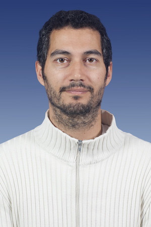

The NRT design team consists of staff from Liverpool John Moores University (LJMU), the Instituto de Astrofisica de Canarias (IAC) and the National Astronomical Research Institute of Thailand (NARIT). 

Below is a description of the partner institutes and a brief bio and photo of each of the team members.

# LJMU

The Liverpool John Moores University team are part of the [Astrophysics Research Institute (ARI)](http://www.astro.ljmu.ac.uk). The Liverpool Telescope team currently consists of ten staff members and one PhD student, with one postdoc and three new NRT staff starting before the end of 2018. The ARI have a large time-domain research group who utilise the LT and advise on its potential science uses. 

Coming soon at LJMU:
* DevOps Software Engineer
* Systems Engineer
* Mechanical Engineer

# IAC

The Instituto de Astrofísica de Canarias (IAC) is an international research centre based in the Canary Islands, Spain. They centres and observing sites on La Palma and Tenerife. The IAC officially became a partner on the NRT project in April 2016 when they signed a memorandum of understanding with LJMU. Since then the IAC have been building their team of engineers and have started exploring design concepts for the telescope and optical system.

# NARIT

## Dr. Chris Copperwheat
**NRT Deputy-PI**
<c.m.copperwheat@ljmu.ac.uk>

I am the Liverpool Telescope Astronomer in Charge and a Reader in Time Domain Astrophysics in the Astrophysics Research Institute at Liverpool John Moores University. I obtained my PhD in 2007 from University College London, and then worked as a postdoctoral researcher at the University of Warwick before joining LJMU in 2012. My research interests span a wide array of time variable phenomena, including (but not limited to) white dwarf binaries, exoplanets and gravitational wave counterparts.

## Dr. Carlos Gutierrez
**Co-PI**

## Dr. Éamonn Harvey
**NRT Instrument Scientist**
<e.j.harvey@ljmu.ac.uk>

I finished my PhD entitled the 'Structure and Evolution of Classical Nova Shells' in January 2018 at NUI Galway. I now work as the Instrument Scientist for the Liverpool New Robotic Telescope to be built on the Roque de los Muchachos (La Palma). Aside from developing the instrumentation for the New Robotic Telscope, my research interests revolve around the nebulae created from stellar destruction events in binary systems. Outside of work you may find me swimming in the ocean or surfing the sidewalks. 

## Dr. Helen Jermak
**NRT Project Scientist**
<h.e.jermak@ljmu.ac.uk>

I obtained my PhD from LJMU in 2016 and worked as an E-ELT PDRA at Lancaster University, and an Instrument Scientist for the MOPTOP polarimeter project at LJMU before joining the NRT project in Spring 2018. My research interests are optical polarimetry, particularly of blazars, and instrumentation. I am one of the co-chairs of the ARI's Equality and Diversity team and I am also the Diversity and Wellbeing representative for the departmental Management Board. In my spare time I like to play rugby, practice yoga and see live music.

## Prof. Johan Knapen
**Staff Astronomer**

## Mr. Adrian McGrath
**NRT Project Manager**
<a.m.mcgrath@ljmu.ac.uk>

I am the New Robotic Telescope Project Manager. I am a Prince2 and Scrum Master qualified Project Manager who has used these methodologies in isolation and combined to deliver a variety of different sized projects.
Multi-disciplined projects like the NRT are a great opportunity to develop existing skills and learn new ones. I’m excited to discover what new skills I’m going acquire during this project.

## Mr. Asier Oria Carreras 
**Mechanical Engineer**

I am a mechanical engineer with strong interest in R&D projects currently working as part of the IAC New Robotic Telescope design team.
I have previous experience in ground astrophysical instrumentation projects which were by far smaller than a 4m-class telescope.
For this reason I am willing to learn as much as possible from this exciting new project.

## Dr. Thirasak Panyaphirawat 
**Project Partner**

## Prof. Rafael Rebolo
**IAC Director**

## Mr. Juan José Sanabria Cumbreño 
**Software Engineer**

I have been working for years as software engineer in Madrid in different projects and companies. I moved to Tenerife where I became telescope operator for two of the night time telescopes placed in the Teide Observatory. In addition, in the IAC, I have worked as an engineer designing software for scientific instrumentation, data analysis and telescope control. I am an amateur astronomer and I like to observe the night sky regularly with the naked eye and binoculars.

## Prof. Iain Steele 
**NRT Director**
[Iain Steele]<i.a.steele@ljmu.ac.uk>

I am the LT Director and Head of the Technology Group at ARI, LJMU.  I obtained my PhD in observational infrared astronomy from the Univeristy of Leicester in 1994, and then worked as a Research Fellow at the University of Southampton until 1996 when I moved to LJMU to work on the original robotic telescope project.  My research interests include novel astronomical instrumentation, especially polarimetric and spectroscopic, as well as observational work on a wide range of time variable phenomena including GRBs, Be stars, blazars and exoplanets.  Although I am from Newcastle upon Tyne, I have absolutely no interest in football!

## Mr. Miguel Ángel Torres Gil
**NRT Systems Engineer**

I am a computer engineer with a great affinity to hardware and electronics. I have worked in a variety of different R&D projects, from asistive technologies for blind people to unmanned solar airplanes, wind tunnels and assistant robots. I have also worked a lot on prototyping and researching involving mechanics, electronics and software. In the NRT project I have the oportunity of participating in a bigger project and develop my skills as a systems engineer. The NRT is an exciting project where I am sure I will develop new skills and learn a lot from excelent engineers and scientists.
