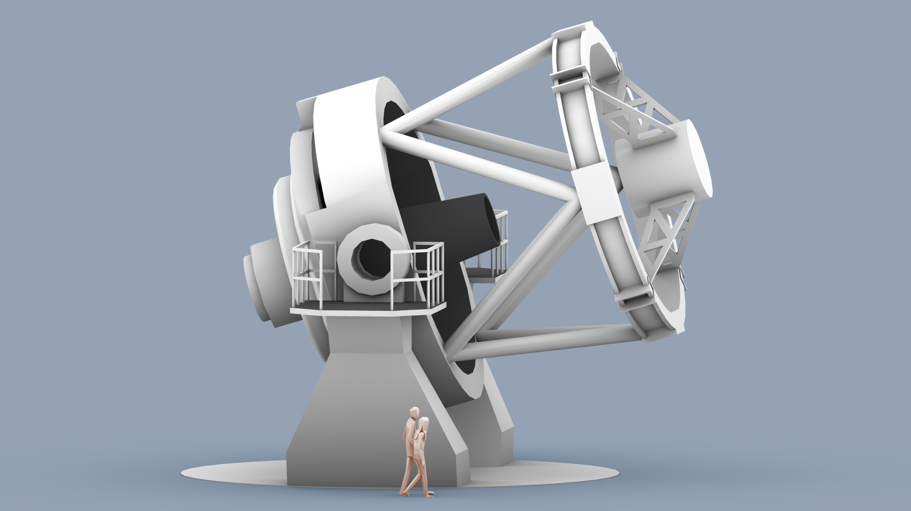

Building on the success of the fully autonomous and robotic [Liverpool Telescope](http://telescope.livjm.ac.uk/), the design of its 4 metre successor is underway. The focus is on fast follow-up of rapidly varying and fading transients, including gravitational wave candidates and new and exciting objects, which are anticipated to be discovered in the new upcoming era of survey telescopes. The next decade will see the commissioning of many major international projects, opening new windows on the time-variable universe. They will make it possible to search wider areas of the sky than ever before, and as such discover new classes of transient and time-variable sources at optical, radio and high-energy Gamma-ray wavelengths and exploiting multimessenger and particle physics too. There is a critical need for a new 4.0m optical follow-up facility to rapidly respond to such discoveries and make detailed photometric, spectroscopic and polarimetric observations.

The NRT is designed for rapid follow-up of transient objects (see our [Science Case](science_case.md) for full details). The 4 metre diameter mirror allows the exploration of fainter sources and shorter exposure times (and thus increased cadence monitoring) of variable objects.

The baseline optical design that has been developed for the 4 metre facility is a Ritchey-Chrétien telescope with a 4 metre primary mirror of focal ratio = f7.5. The design uses an f1.75 primary mirror and a back focal distance of 2.5m; allowing sufficient optical path length to provide possible Nasmyth (along with Cassegrain) foci and to allow for the mechanics of the tube, mirror support and instrumentation. The mirror design is still in discussion, with segmented and monolithic designs having a variety of advantages and disadvantages. Hexagonal, circular and petal segment shapes are currently being analysed, along with a monolithic design. 

The iconic clamshell enclosure of the Liverpool Telescope allows rapid slewing across the sky, without waiting for dome rotation, it also removes any effects from dome seeing. It does, however, leave the telescope vulnerable to wind shake, and delicate instrumentation housed on the telescope Cassegrain can be exposed to Calima. For the new facility the design team are exploring both dome and enclosure structures, allowing the telescope to slew across the sky to be on target within 30 seconds.
