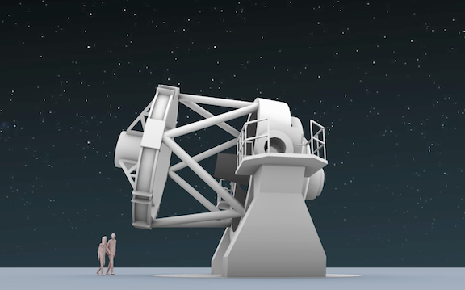
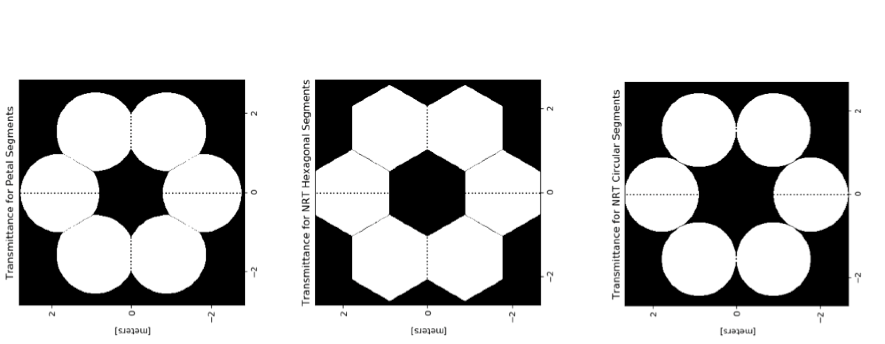
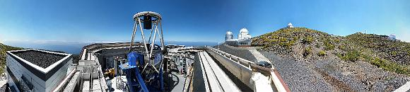
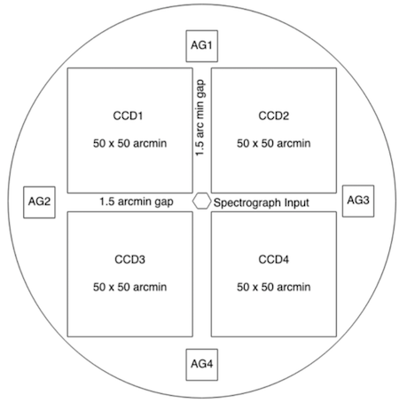

Building on the success of the fully autonomous and robotic [Liverpool Telescope](http://telescope.livjm.ac.uk/) which has been observing robotically since 2004, the design of its 4 metre successor, the New Robotic Telescope (NRT) is underway. The focus is on fast follow-up of rapidly varying and fading transients, including gravitational wave candidates and new and exciting objects, which are anticipated to be discovered in the new upcoming era of survey telescopes. The next decade will see the commissioning of many major international projects, opening new windows on the time-variable universe. They will make it possible to search wider areas of the sky than ever before, and as such discover new classes of transient and time-variable sources at optical, radio and high-energy Gamma-ray wavelengths and exploiting multimessenger and particle physics too. There is a critical need for a new 4.0m optical follow-up facility to rapidly respond to such discoveries and make detailed photometric, spectroscopic and polarimetric observations.

## Optical design
{: .align-center}

The NRT is designed for rapid follow-up of transient objects (see the [Science Case](science_case.md) for full details). The 4-metre diameter mirror will enable the exploration of fainter sources and shorter exposure times (and thus increased cadence monitoring) of transient and variable objects.

The baseline optical design that has been developed for the facility is a Ritchey-Chrétien telescope with a 4-metre primary mirror of focal ratio = f7.5. The design uses an f1.75 primary mirror and a back focal distance of 2.5m; allowing sufficient optical path length to provide possible Nasmyth (along with Cassegrain) foci and to allow for the mechanics of the tube, mirror support and instrumentation. The mirror design is still in discussion, with 6-segment (plus spare) and monolithic designs having a variety of advantages and disadvantages. 

## Mirror design
{: .align-center}

A 6-segment hexagonal or petal design would allow easier removal of segments, more regular maintenance, less down-time and are lighter than a monolithic mirror (due to the thickness required to stabilise a 4-metre monolith). Seven identical segments would be used in rotation, allowing the telescope to continue observing during recoating without needing to go offline. A monolithic mirror would also be a single point of failure; if it were to be damaged in the removal/recoating process there is no back-up. A monolithic mirror ideally requires a crane fixed to the dome for removal. The current LT enclosure does not allow for a fixed crane, so an external crane is required.

The monolithic design of course offers the simplest route to excellent image quality, as no phasing or co-aligning is required. Without the gaps between segments it is possible to explore the Infrared without additional heat from behind the mirrors affecting sensitivity. The only active optics consideration for a monolithic mirror is the alignment of the primary and secondary mirrors, whereas for a segmented design there is the additional complexity of co-aligning (ensuring all the mirrors are aligned so that overlapping images appear to come from a single telescope) and phasing (very accurate alignment that allows the mirrors to function as a single surface). Co-aligning is a much simpler process than phasing, but does not exploit the potential resolution of the 4-metre mirror, if the segments are co-aligned but not phased, the angular resolution is just that of a single segment.

Segmented mirrors require complicated software to co-align or phase the mirrors, such technology has never been exploited fully autonomously and thus poses new challenges. The mirror supports required to accurately align/phase the mirrors also add additional weight, which may result in a segmented design being comparative in weight to a monolithic mirror (which has a simpler mirror support system). In addition, the rapid slew of the telescope may require more frequent mirror alignment/phasing than a traditional telescope, which could increase overheads for each observation. The mechanical challenges of rapidly slewing a 4-metre monolith mirror are substantial, and the settle time required may be greater than that of individual segments. The key driver of the NRT is to rapidly acquire the target and obtain good data as quickly as possible. This aim is at the core of our design decision making process.

## Enclosure design

{: .align-center}

The iconic clamshell enclosure of the LT is operated by hydraulic rams that deploy to allow the three panels on either side to lower and overlap each other, creating an entirely open space around the telescope. This design allows the LT to rapidly slew across the sky arriving at the target of interest within minutes, without waiting for dome rotation, it also removes any effects from dome seeing. It does, however, leave the telescope vulnerable to wind shake, and delicate instrumentation housed on the telescope Cassegrain can be exposed to Calima (the hot, dry dust that comes from the Sahara). The lack of a permanent roof above the telescope also means that there is no place for a crane to be fixed for removal of mirrors or instrumentation from the telescope.

As part of the NRT design, we are exploring the benefits and issues with domes and enclosures. A slow, heavy dome could increase the response time of the telescope so we are in discussion with construction companies about new light-weight materials and means of rotating the dome at a speed comparable to that of the telescope itself. The telescope housing is the most important barrier to the elements, and if it fails it can have catastrophic results. In the 20+ years of the LT's operation, the enclosure has failed twice (without any serious implications), however, as it is a robotic, autonomous and entirely unmanned facility during operation, a reliable housing for the telescope is an absolutely crucial component of the design. A dome's shutter could be designed so that during a loss of power, the shutter closes itself under its own weight; this would not be possible with an enclosure as the panels close against gravity. We continue to explore new ideas and designs, and apply all the knowledge we have from 20+ years of LT operations.

## The future of the Liverpool Telescope

The Liverpool Telescope, following first light in 2004, is now at a mature stage in its life. It has had a strong record of high-impact papers in leading scientific journals and is the basis for a thriving [outreach](NSO.md) programme with over 2000 UK and Irish schools having obtained their own data via the [Schools' Observatory](https://www.schoolsobservatory.org/). The robotic nature of the telescope means that it has a low operating cost, making it excellent value for money when compared to its manned competitors. 

As we move forward with NRT project, the role of the LT will change to enhance the synergy between the two facilities. The plan for the LT is to simplify the instrumentation suite to a wide-field 2x2 degree camera at prime focus and a straight-through fibre-fed spectrograph. These instruments align well with gravitational-wave counterpart candidate searches and surveys, along with the monitoring of other transient and variable objects. The two telescopes would be run as a combined facility providing simultaneous spectroscopy and photoemtry of the same target and the LT would be operated as a transient-finding facility. The Palomar Transient Factory has demonstrated the utility of this factory approach to transient science, and a fully automotated robotic facility would be extremely productive.

{: .align-center}

The two facilities will be available to all partners of the NRT project, and in addition they will continue to be made available to school children across the world via the Schools' Observatory, and the amount of observing time on the Liverpool Telescope will increase from its current level of 10%. For more information about our future outreach programmes see our [outreach](NSO.md) page.
