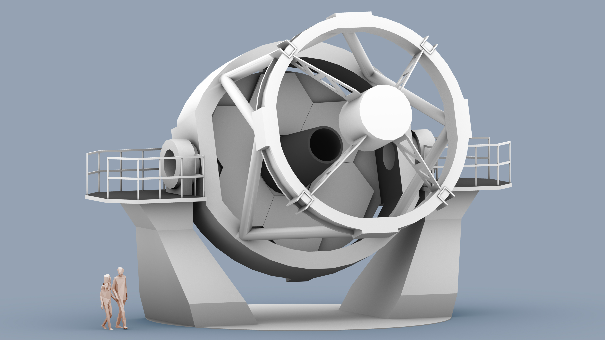

 

The New Robotic Telescope (NRT) will be co-located with the current Liverpool Telescope (LT) on the Canary Island of La Palma. The proposed site for construction is the disused Carlsberg Meridian Telescope site, close to the William Herschel Telescope (WHT). 

The La Palma location will be complementary to the specialized observing roles being adopted by the ING telescopes with WEAVE delivering statistically complete catalogues of object populations and NRT delivering follow-up of variable and the rare objects not well suited to the massively multiplexed WEAVE model. It will play a key role in monitoring the Northern transient sky (many sources of transients are all sky e.g. Gaia, GWs, GRBs or Northern e.g., ZTF, CTA-N, IceCUBE etc.). La Palma is also sufficiently equatorial that many LSST targets will be visible for ~4-6 hours per night. Co-location with the GOTO GW counterpart finder and the current LT (which we planto transition to a wide field survey/transient detection machine) also adds value. The La Palma site therefore offers considerable scientific synergies and opportunities, combined with its logistical and cost advantages due to its relatively nearby location and well developed existing infrastructure.

The NRT is designed for rapid follow-up of transient objects (see our [Science Case](science_case.md) for full details). The 4 metre diameter mirror allows the exploration of fainter sources and shorter exposure times (and thus increased cadence monitoring) of variable objects.

The baseline optical design that has been developed for the 4 metre facility is a Ritchey-Chrétien telescope with a 4 metre primary mirror of focal ratio = f7.5. The design uses an f1.75 primary mirror and a back focal distance of 2.5m; allowing sufficient optical path length to provide possible Nasmyth (along with Cassegrain) foci and to allow for the mechanics of the tube, mirror support and instrumentation. The mirror design is still in discussion, with segmented and monolithic designs having a variety of advantages and disadvantages. Hexagonal, circular and petal segment shapes are currently being analysed, along with a monolithic design. 

The iconic clamshell enclosure of the Liverpool Telescope allows rapid slewing across the sky, without waiting for dome rotation, it also removes any effects from dome seeing. It does, however, leave the telescope vulnerable to wind shake, and delicate instrumentation housed on the telescope Cassegrain can be exposed to Calima. For the new facility the design team are exploring both dome and enclosure structures, allowing the telescope to slew across the sky to be on target within 30 seconds.
