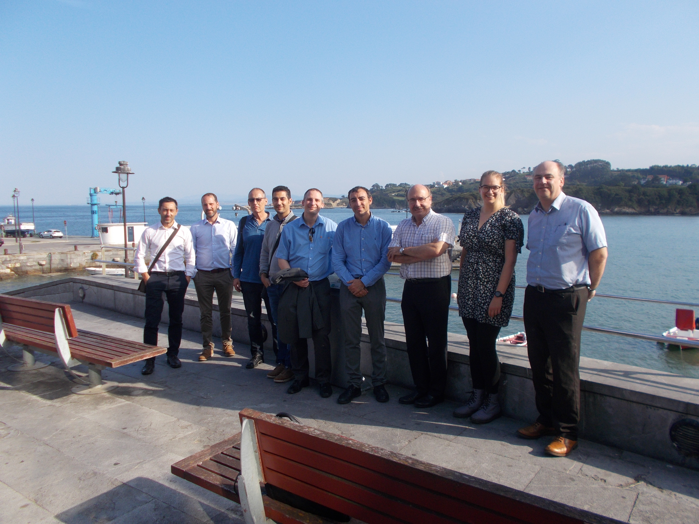

On 27th September, project partners from LJMU and the IAC visited Spanish industrial company [Asturfeito](https://www.asturfeito.com/) in Oviedo, Spain. Asturfeito have been building the 400 tonne telescope mount assembly for the Large Synoptic Survey Telescope (LSST) in their factory in northern Spain, and as part of collaborations with the University of Oviedo, the NRT project partners visited the factory for a tour. Javier de Cos Juez from the University of Oviedo, Adrian McGrath, Iain Steele and Helen Jermak from LJMU, along with Rafael Rebolo, Carlos Gutierrez and Miguel Torres Gil from IAC, visited Ricardo Rodríguez and Francisco Romero at Asturfeito to view the telescope mount assembly and discuss Asturfeito's potential involvement in the NRT project.

<video width="480" height="320" controls="controls">
  <source src="LSST.mp4" type="video/mp4">
</video>

As part of the visit, the team held an NRT board meeting where they presented the latest developments, discussed the delivery model  design work of the project. 

