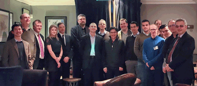

# Ground-breaking rapid robotic follow-up with a 4-metre successor to the Liverpool Telescope

Welcome to the new webpage for the Liverpool New Robotic Telescope (NRT); a collaboration between Liverpool John Moores University and the Instituto de Astrofísica de Canarias. The [design team](team.md), established in early 2018, are in the process of finalising the engineering and science requirements of the [facility](telescope.md). The NRT [science case](science_case.md) details the science drivers for the project; the NRT team welcome ideas and contributions across the astronomy community. To get in touch see our [design team](team.md) page.

The [news](news.md) page details the latest project developments including workshops, meetings, partners and outreach.

 

NRT Workshop group photo. Left to right: Marco Lam, Iain Steele, Robin Leatherbarrow, Abigail Lewis, Paulo Lisboa, Ian Baker, Adrian McGrath, Phil James, Suparerk Aukkaravittayapun, Chris Copperwheat, Saran Poshyachinda, Juan Cozar, Christophe Buisset, Helen Jermak, Thirasak Panyaphirawat, Apirat Prasit, Carlos M Gutierrez, Ahmed Al Shamma’a. Credit: Marco Lam.

