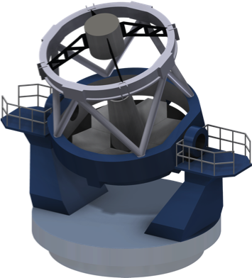

The New Robotic Telescope (NRT) is a Liverpool John Moores University project in collaboration with the Instituto de Astrofísica de Canarias (IAC) and the National Astronomical Research Institute of Thailand (NARIT). 

Following on from the on-going success of the 2-metre fully autonomous and robotic Liverpool Telescope (LT), the NRT will be a 4-metre telescope, co-located with the LT on La Palma, designed for rapid-response, time-domain astronomy. The project is currently in the design phase, with an on-sky target date of 2023. A combination of light-weight mirror technology and advanced material science will allow the NRT to slew to any part of the sky and be observing a target within 30 seconds. 

| --- |
| | 

